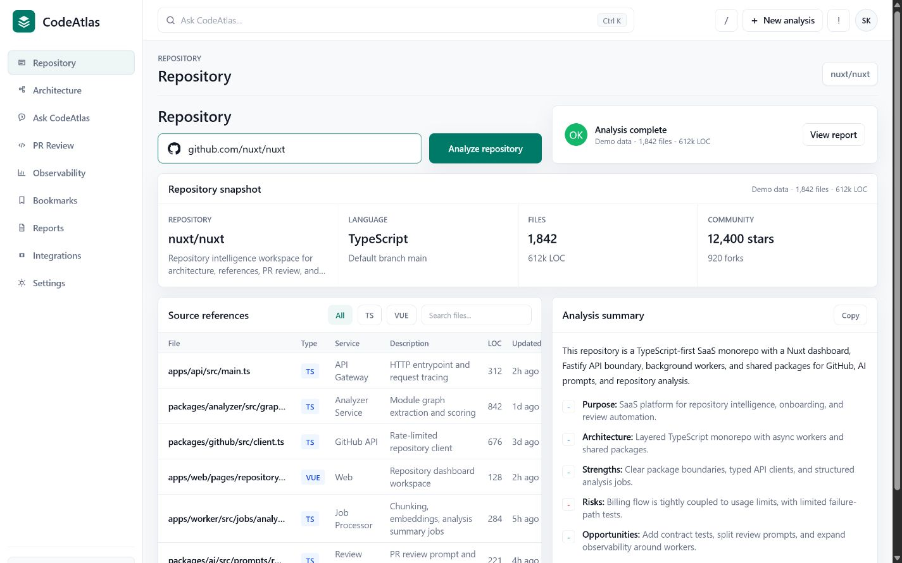
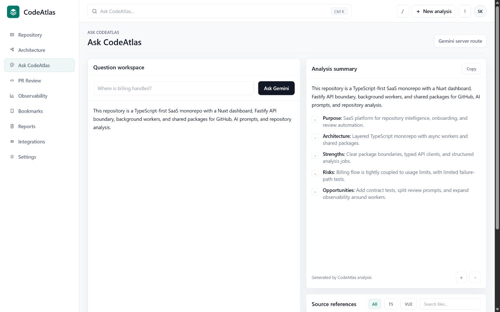
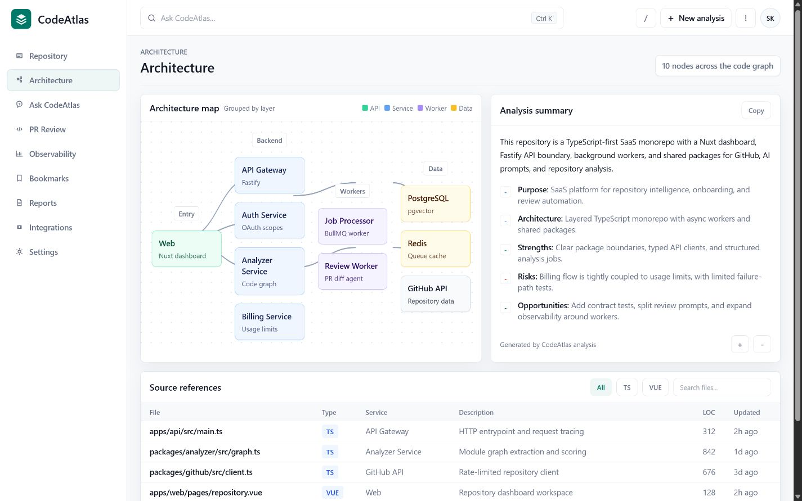
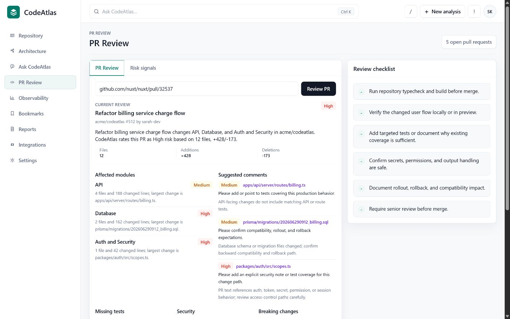
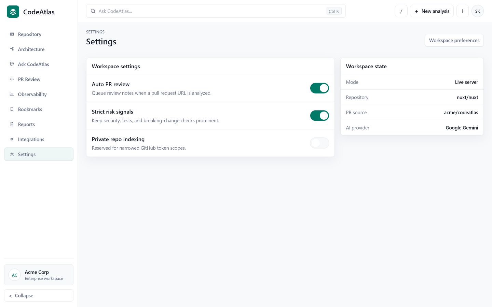
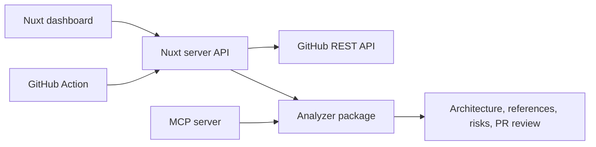

# CodeAtlas

[](https://github.com/StepanDrogin/CodeAtlas/actions/workflows/ci.yml)

AI-ready codebase intelligence platform for GitHub repositories.

CodeAtlas turns a public GitHub repository into an architecture map, searchable project knowledge base, PR review assistant, and observability dashboard for analysis jobs.



## Why This Project Exists

Large codebases are hard to enter quickly. CodeAtlas gives a developer a first working mental model:

- what the repository is built with;
- where the important files are;
- how the architecture is shaped;
- which risks are visible from repository metadata;
- what a pull request changes and what deserves review attention.

The current MVP uses deterministic analysis over GitHub API data as the reliable baseline and can enhance repository summaries, Q&A, and PR review copy with Google Gemini when a server-side API key is configured.

## Features

- Public GitHub repository analysis through the GitHub REST API.
- Repository metadata, tree, README, package manifests, and open pull requests.
- Architecture map grouped by entry, backend, workers, and data layers.
- Source references table with file search and type filters.
- PR review mode with affected modules, missing tests, security concerns, breaking-change signals, and suggested comments.
- Risk signals for missing tests, missing CI, truncated trees, env-like files, and install lifecycle scripts.
- Observability strip for latency, error rate, requests, token usage, cost, and jobs.
- Section-based dashboard navigation for repository, architecture, Q&A, PR review, observability, bookmarks, reports, integrations, and settings.
- Browser-persisted workspace snapshots: active analysis, AI answer, PR review, report state, settings, and recent workspaces restore after reload.
- Workspace setup checklist for connect, analyze, source-grounded AI, and report export.
- Markdown and JSON report export from the current repository workspace.
- AI Q&A evidence context with selected source references and confidence scoring.
- Architecture node explorer with a one-click "ask about this node" workflow.
- Optional Gemini-powered repository summaries, Q&A, and PR review refinement through Nuxt server routes.
- MCP stdio server scaffold for AI coding tools.
- Composite GitHub Action scaffold for PR review workflows.
- CI and Docker packaging.

## Screenshots

### Repository Intelligence


### Knowledge And References



### Architecture Map



### PR Review



### Workspace Settings



## Tech Stack

- Nuxt 3
- Vue 3 Composition API
- TypeScript
- Tailwind CSS with project design tokens
- Node built-in test runner
- npm workspaces
- GitHub REST API
- Google Gemini API
- Docker

## Project Structure

```text
apps/
  github-action/  Composite GitHub Action scaffold
  mcp-server/     Dependency-free MCP stdio server
  web/            Nuxt dashboard app
docs/
  demo-script.md  Manual demo checklist
  screenshots/    README screenshots
packages/
  analyzer/       Pure repository and PR analysis package
```

## Local Development

```bash
npm install
copy .env.example .env
npm run dev
```

The web app runs on `http://localhost:3000`.

Set `NUXT_GITHUB_TOKEN` in `.env` for higher GitHub API limits and `GEMINI_API_KEY` for AI summaries, Q&A, and PR review copy:

```env
NUXT_GITHUB_TOKEN=your_github_token
GEMINI_API_KEY=your_gemini_api_key
GEMINI_MODEL=gemini-3.5-flash
```

The root `npm run dev` script forwards this root `.env` file to the Nuxt workspace.

Fine-grained token permissions for public repository analysis:

- Contents: read-only
- Pull requests: read-only
- Metadata: read-only

## GitHub Pages Demo

Static demo URL:

```text
https://stepandrogin.github.io/CodeAtlas/
```

The GitHub Pages build is a portfolio demo generated with `npm run build:pages` and `NUXT_PUBLIC_DEMO_MODE=true`. GitHub Pages does not run Nuxt server API routes or private environment variables, so live repository analysis and future LLM calls need a server-capable host.

## Server Deployment With AI

For a public live demo with GitHub API calls and Gemini, deploy the Nuxt app to Vercel.

1. Push this repository to GitHub.
2. In Vercel, choose **Add New > Project**.
3. Import `StepanDrogin/CodeAtlas`.
4. In **Root Directory**, choose `apps/web`.
5. Keep the framework preset as **Nuxt.js**.
6. Keep the build settings from `apps/web/vercel.json`:

```text
Install Command: npm ci
Build Command: npm run build -w @codeatlas/analyzer && npm run build
```

7. Add production environment variables:

```text
NUXT_GITHUB_TOKEN=your_github_token
GEMINI_API_KEY=your_gemini_api_key
```

Optional:

```text
GEMINI_MODEL=gemini-3.5-flash
```

`NUXT_PUBLIC_DEMO_MODE` defaults to `false`, so Vercel runs the live Nuxt server API routes for repository analysis, PR review, and Gemini Q&A.

## Demo Flow

1. Open `http://localhost:3000`.
2. Analyze a repository:

```text
github.com/nuxt/nuxt
```

3. Review a pull request:

```text
https://github.com/nuxt/nuxt/pull/35489
```

4. Ask a local question in the command bar:

```text
Where is app config handled?
```

5. Open **Architecture**, select a node, then use **Ask about this node** to prepare a source-grounded AI question.
6. Open **Reports** and export the current workspace as Markdown or JSON.
7. Reload the page; the active workspace and recent analysis archive are restored from browser storage.

## Quality Gates

```bash
npm run typecheck
npm run test
npm run build
```

What these cover:

- `@codeatlas/analyzer` typecheck and unit tests.
- MCP server typecheck and build.
- Nuxt typecheck and production build.

## API Surface

```text
POST /api/repositories/analyze
body: { "repository": "github.com/owner/repo" }

POST /api/pull-requests/review
body: { "pullRequest": "github.com/owner/repo/pull/123" }

POST /api/ai/question
body: { "question": "Where is routing configured?", "repositoryFullName": "owner/repo", "references": [] }
```

Repository and PR endpoints use the GitHub REST API and the same `NUXT_GITHUB_TOKEN` runtime config. When `GEMINI_API_KEY` is available, they also ask Gemini to refine dashboard summaries, PR summaries, suggested comments, and command-bar Q&A.

The AI question endpoint returns a UI-ready evidence payload:

```json
{
  "answer": "Concise source-grounded answer",
  "references": [
    {
      "file": "apps/web/app.vue",
      "type": "VUE",
      "service": "Frontend",
      "description": "Repository dashboard workspace",
      "loc": 128,
      "updated": "Indexed now"
    }
  ],
  "confidence": 82
}
```

## Analyzer Package

`packages/analyzer` is pure TypeScript and has no network dependency. It accepts repository or PR snapshots and returns UI-ready intelligence:

- technologies;
- architecture nodes;
- source references;
- summary items;
- risk signals;
- PR module impact;
- suggested review comments.

This keeps GitHub I/O in Nuxt server routes and analysis logic in a testable package.

## MCP Server

```bash
npm run build -w @codeatlas/mcp-server
node apps/mcp-server/dist/index.js
```

Implemented tools:

- `analyze_repository_snapshot`
- `review_pull_request_snapshot`

## GitHub Action

The composite action lives in `apps/github-action`.

```yaml
- uses: ./apps/github-action
  with:
    codeatlas-api-url: https://your-codeatlas.example.com
    github-token: ${{ secrets.GITHUB_TOKEN }}
```

Human setup still required: deploy the Nuxt app somewhere reachable by GitHub Actions, then pass that URL as `codeatlas-api-url`.

## Docker

```bash
docker compose up --build
```

The container exposes the Nuxt app on `http://localhost:3000`.

## Architecture



## Current AI Status

The app uses deterministic, testable repository analysis as the baseline and optionally enhances results with Gemini through server-side REST calls.

Implemented Gemini layer:

- repository dashboard summary refinement;
- command-bar Q&A over indexed source references;
- AI-assisted PR review summary and suggested comments;
- deterministic fallback when Gemini is not configured or returns an invalid response.

## Roadmap

- Add persisted analysis jobs and background workers.
- Add embeddings and semantic code search.
- Add private repository support through GitHub App installation.
- Publish the GitHub Action.
- Add OpenTelemetry traces and real cost dashboards.
